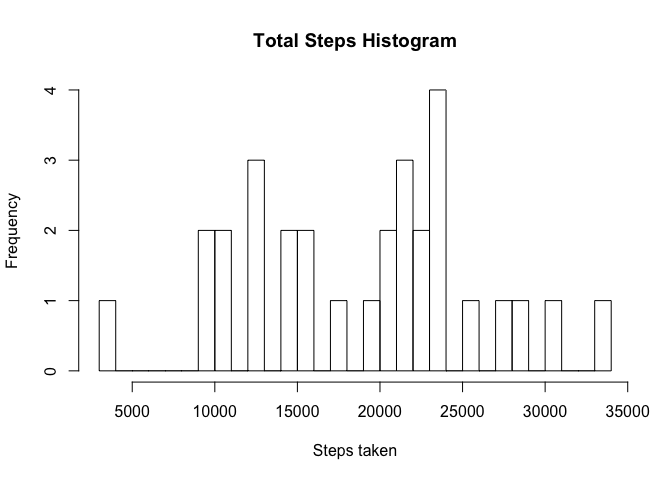
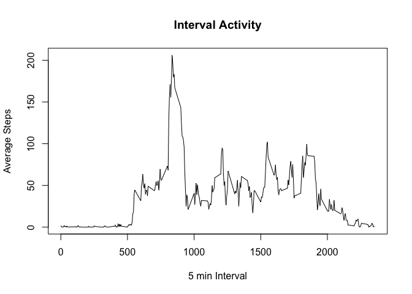
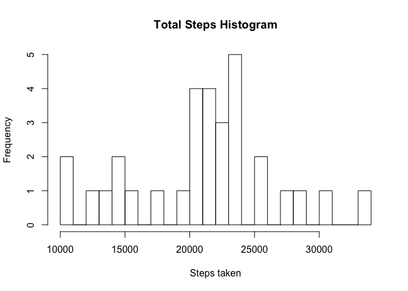
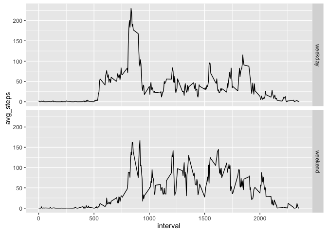

# RepData_PeerAssessment1
Denver Durham  
July 9, 2016  

## Loading and preprocessing the data

###Show any code that is needed to
1. Load the data (i.e. read.csv())
2. Process/transform the data (if necessary) into a format suitable for your analysis


```r
## Import 'activity.csv' and format date column
data <- read.csv("activity.csv", header = TRUE, stringsAsFactors = FALSE)
data$date <- strptime(data$date, format="%Y-%m-%d")
```

## What is mean total number of steps taken per day?

For this part of the assignment, you can ignore the missing values in the dataset.
Make a histogram of the total number of steps taken each day


```r
## Find the sum, mean, and median steps per day
library(lubridate)
```

```
## 
## Attaching package: 'lubridate'
```

```
## The following object is masked from 'package:base':
## 
##     date
```

```r
data2 <- na.omit(data) # Remove NAs
data2_sum <- aggregate(data2$steps, by=list(day(data2$date)), sum) # Aggregate sum
names(data2_sum) <- c("Day", "Total_Steps") # Rename columns
hist(data2_sum$Total_Steps, breaks = length(data2_sum$Day), main="Total Steps Histogram", xlab="Steps taken") # Plot in histogram
```

<!-- -->

Calculate and report the mean and median total number of steps taken per day


```r
data_mean <- mean(data2_sum$Total_Steps)
data_median <- median(data2_sum$Total_Steps)
```

The Mean number of steps each day is 1.9020267\times 10^{4}.
The Median steps each day is 2.05975\times 10^{4}.

## What is the average daily activity pattern?

Make a time series plot (i.e. type = "l") of the 5-minute interval (x-axis) and the average number of steps taken, averaged across all days (y-axis)


```r
## Aggregate the 5-min interval and then the mean steps per day
interval_steps <- aggregate(data2$steps, by=list(data2$interval), mean)
plot(interval_steps$Group.1, interval_steps$x, type="l", main="Interval Activity", xlab="5 min Interval", ylab="Average Steps")
```

<!-- -->

Which 5-minute interval, on average across all the days in the dataset, contains the maximum number of steps?


```r
max_steps <- interval_steps$Group.1[interval_steps$x == max(interval_steps$x)]
```

The 5-minute interval with the most steps on average is 835.

## Inputing missing values

Note that there are a number of days/intervals where there are missing values (coded as NA). The presence of missing days may introduce bias into some calculations or summaries of the data.

Calculate and report the total number of missing values in the dataset (i.e. the total number of rows with NAs)

Devise a strategy for filling in all of the missing values in the dataset. The strategy does not need to be sophisticated. For example, you could use the mean/median for that day, or the mean for that 5-minute interval, etc.

Create a new dataset that is equal to the original dataset but with the missing data filled in.

Make a histogram of the total number of steps taken each day and Calculate and report the mean and median total number of steps taken per day. Do these values differ from the estimates from the first part of the assignment? What is the impact of imputing missing data on the estimates of the total daily number of steps?


```r
## Input missing values based on daily average for that 5-minute interval
total_na <- length(is.na(data$steps)) # count number of NA values
data3 <- data # backup data frame
data3$steps <- ifelse(is.na(data3$steps)==TRUE, interval_steps[interval_steps$Group.1 %in% data3$interval, 2], data3$steps) # replace NA values with 5 min interval averages
data3_sum <- aggregate(data3$steps, by=list(day(data3$date)), sum) # Aggregate sum
hist(data3_sum$x, breaks = length(data3_sum$Group.1), main="Total Steps Histogram", xlab="Steps taken") # Plot in histogram
```

<!-- -->

```r
data3_mean <- mean(data3_sum$x)
data3_median <- median(data3_sum$x)
```

The Mean number of steps each day is 2.1185081\times 10^{4}.
The Median steps each day is 2.1641\times 10^{4}.

## Are there differences in activity patterns between weekdays and weekends?

For this part the weekdays() function may be of some help here. Use the dataset with the filled-in missing values for this part.

Create a new factor variable in the dataset with two levels -- "weekday" and "weekend" indicating whether a given date is a weekday or weekend day.

Make a panel plot containing a time series plot (i.e. type = "l") of the 5-minute interval (x-axis) and the average number of steps taken, averaged across all weekday days or weekend days (y-axis).


```r
library(ggplot2)
## Add a new column with weekend or weekday identifier
data4 <- data3
data4$day <- ifelse(weekdays(data3$date) %in% c("Saturday", "Sunday"), "weekend", "weekday") # Define weekdays
data4_mean <- aggregate(data4$steps, by=list(data4$day, data4$interval), mean) # Aggregate means
names(data4_mean) <- c("day", "interval", "avg_steps") # Name data
ggplot(data4_mean, aes(x=interval, y=avg_steps)) + geom_line() + facet_grid(day~.) # Plot lines
```

<!-- -->


